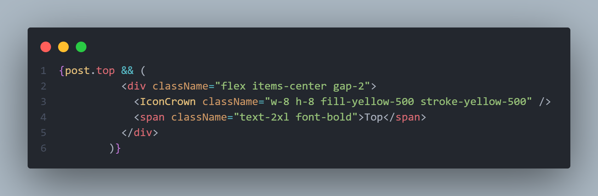
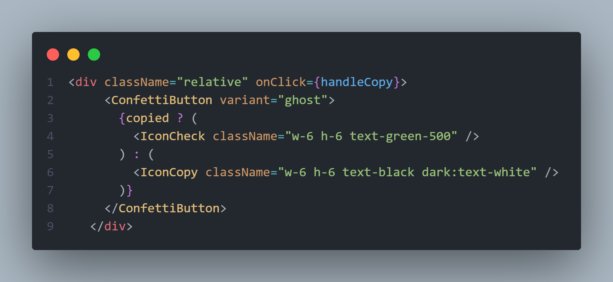
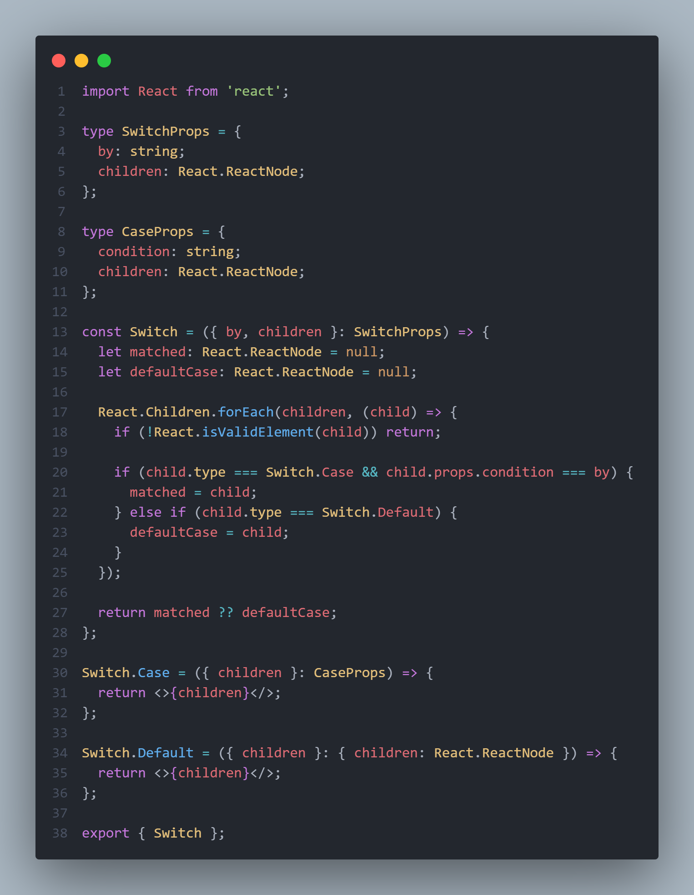
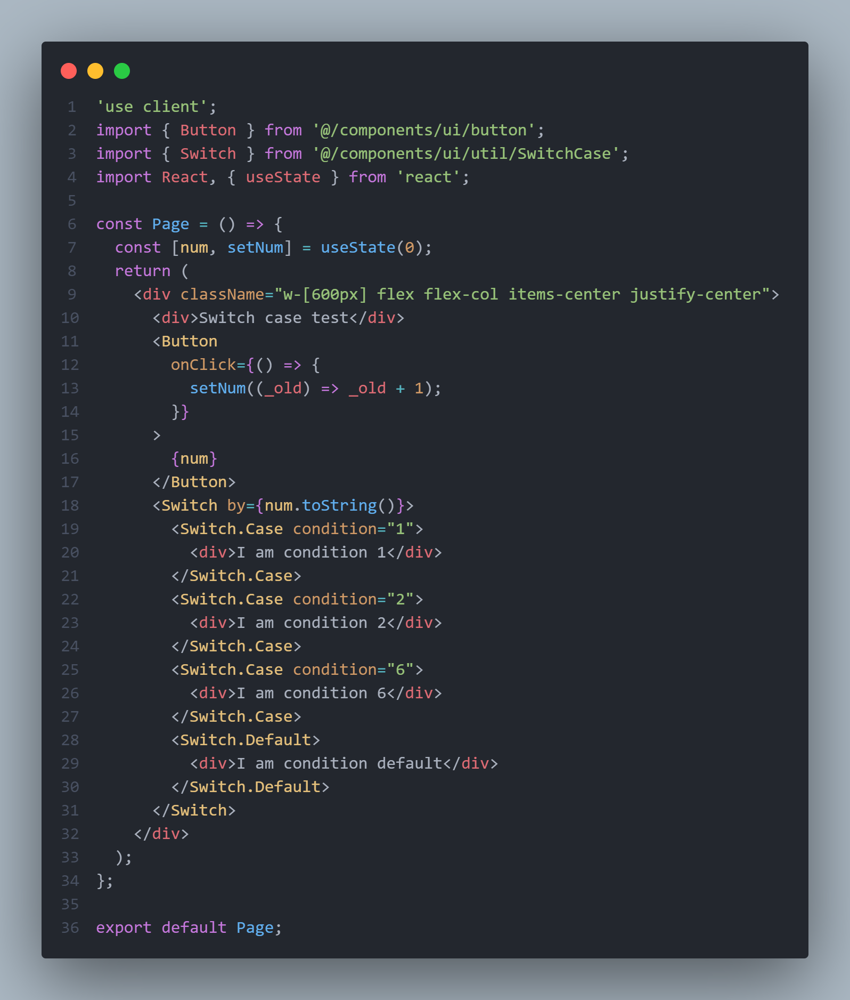

In React, we often find ourselves writing conditional rendering like: `{condition && <Component/>}`.

## Examples from this Website

From my perspective, this pattern significantly impacts code maintainability and readability, yet such pattern has already became part of react syntax.

> I have some thoughts about typescript as well, but we discuss that another time :)

## Is There a Better Way?

During my time learning vuejs in university, I discovered its elegant solution to this problem via _built-in directives_. Not familiar? See the [docs](https://vuejs.org/api/built-in-directives.html).

Of course, Vue.js can implement directives easily because it is based on template. Adding directives to React would be more difficult because we are going to use babel plugins.

So I will use slots, or react children, and I really make it in the end!

Here's my implementation:

> For the sake of shadcn/ui - I have no idea how many methods that the React instance has in last several years 😅

Rather than using If-else blocks, I prefer switch cases for better readability. And the jsx syntax **returns** values, hence we no longer need to write break statements.

Here's a working example, just like the switch-case everyone knows 😎

Go to this link to experience
[demo](/playground/switch-case)
